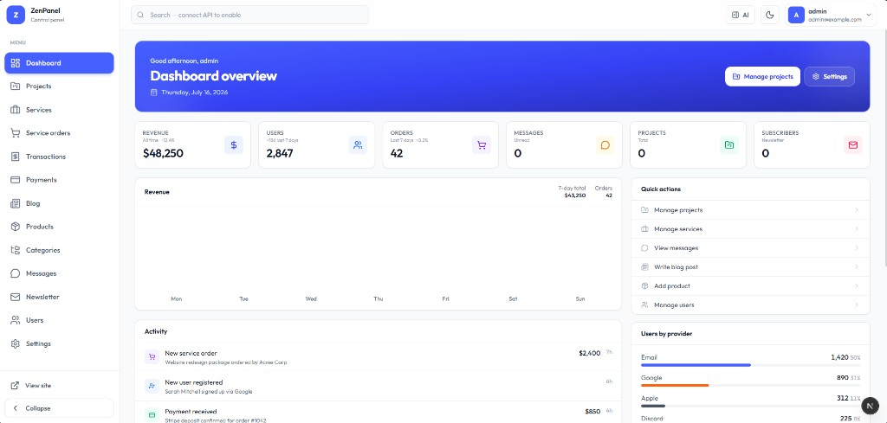
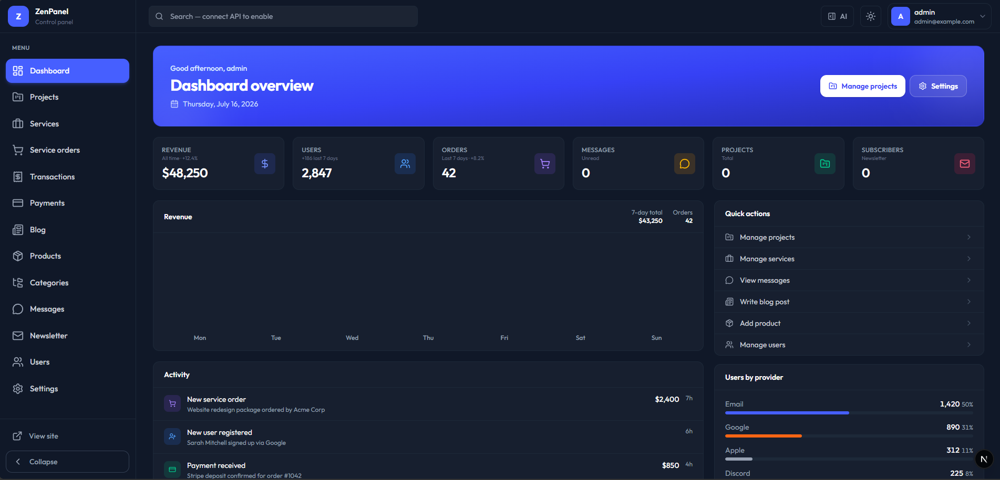

# ZenPanel

[](https://github.com/Foisalislambd/zenpanel/actions/workflows/ci.yml)
[](./LICENSE)
[](https://nodejs.org)

**Open-source admin UI shell** — same polished dashboard across every major web framework.

Scaffold with one command, preview with sample data, then connect your own API when you are ready.

```bash
npx create-zenpanel@latest
```

<p align="center">
  
</p>

<p align="center">
  <em>Light mode</em>
</p>

<p align="center">
  
</p>

<p align="center">
  <em>Dark mode</em>
</p>

---

## Table of contents

- [Why ZenPanel](#why-zenpanel)
- [Quick start](#quick-start)
- [Frameworks](#frameworks)
- [Features](#features)
- [Documentation](#documentation)
- [Customize](#customize)
- [Repository structure](#repository-structure)
- [Contributing](#contributing)
- [License](#license)

---

## Why ZenPanel

- **One design, many frameworks** — Next.js is the visual source of truth; React, Preact, Solid, Svelte, Vue, HTML, Astro, and Angular match the same admin UI.
- **Ship a shell, not a backend** — login, sidebar, dashboard widgets, resource pages, messages, and settings are ready to wire.
- **Preview first** — sample metrics and tables so you can review UX without an API.
- **Easy branding** — name, tagline, logo letter, and nav in one config file per template.

---

## Quick start

**Requirements:** Node.js **20+** (Astro needs **22.12+**)

### 1. Create a project

```bash
npx create-zenpanel@latest
```

You will be asked for:

1. Project name  
2. Framework

Or skip the prompts:

```bash
npx create-zenpanel@latest my-admin --framework nextjs
npx create-zenpanel@latest my-admin --framework react
npx create-zenpanel@latest my-admin --framework preact
npx create-zenpanel@latest my-admin --framework solid
npx create-zenpanel@latest my-admin --framework svelte
npx create-zenpanel@latest my-admin --framework vue
npx create-zenpanel@latest my-admin --framework html
npx create-zenpanel@latest my-admin --framework astro
npx create-zenpanel@latest my-admin --framework angular
```

### 2. Run the app

```bash
cd my-admin
npm run dev
```

### 3. Open admin login

| Framework | URL |
| --- | --- |
| Next.js | [http://localhost:3000/admin/login](http://localhost:3000/admin/login) |
| React · Preact · Solid · Svelte · Vue · HTML | [http://localhost:5173/admin/login](http://localhost:5173/admin/login) |
| Astro | [http://localhost:4321/admin/login](http://localhost:4321/admin/login) |
| Angular | [http://localhost:4200/admin/login](http://localhost:4200/admin/login) |

**Demo credentials:** `admin` / `admin` (UI preview only — not real auth)

### Install into an existing project

```bash
cd your-existing-app
npx create-zenpanel@latest
# or
npx create-zenpanel@latest --install
```

More flags: [CLI reference](./docs/cli.md)

---

## Frameworks

| Framework | Stack | Port |
| --- | --- | --- |
| **Next.js** | App Router · Tailwind 4 | `3000` |
| **React** | Vite 8 | `5173` |
| **Preact** | Vite · `preact/compat` | `5173` |
| **Solid** | Vite · `@solidjs/router` | `5173` |
| **Svelte** | Svelte 5 · Vite | `5173` |
| **Vue** | Vue 3 · `vue-router` | `5173` |
| **HTML** | Plain HTML/CSS/JS · Tailwind CLI | `5173` |
| **Astro** | Astro 7 · Tailwind | `4321` |
| **Angular** | Angular 22 · Tailwind | `4200` |
| **Remix** | — | Coming soon |

Full comparison: [Frameworks guide](./docs/frameworks.md)

---

## Features

- Responsive shell — collapsible sidebar, header, breadcrumbs, user menu
- Dashboard — welcome hero, stats cards, revenue chart, activity feed, quick actions
- Resource pages — table layout / empty states ready for your API
- Messages — two-pane inbox empty state
- Settings — account & branding tabs
- Login — split-screen preview auth
- Light & dark themes
- Optional AI assistant panel (framework-dependent depth)

---

## Documentation

All guides live under [`docs/`](./docs/README.md):

| Guide | What you’ll learn |
| --- | --- |
| [Getting started](./docs/getting-started.md) | Create a project and open `/admin/login` |
| [CLI reference](./docs/cli.md) | Flags, create vs install mode, local CLI builds |
| [Frameworks](./docs/frameworks.md) | Pick a template and understand parity |
| [Customization](./docs/customization.md) | Branding, nav, and where config files live |
| [Theming](./docs/theming.md) | Dark mode, tokens, fonts |
| [Connect your API](./docs/connecting-api.md) | Replace preview data with real endpoints |
| [Publish to npm](./docs/publishing.md) | Ship `create-zenpanel` to the registry |

Screenshots: [`docs/images/`](./docs/images/)

---

## Customize

Edit the admin config for your template (paths vary slightly):

| Framework | Config |
| --- | --- |
| Next.js · React · Preact · Solid · Svelte · Vue | `src/config/admin.config.ts` |
| Angular | `src/app/core/admin.config.ts` |
| HTML | `src/js/config.js` |
| Astro | `src/scripts/config.js` |

Change:

- Brand name, tagline, logo letter  
- Login copy and feature bullets  
- Sidebar navigation links  

Details: [Customization](./docs/customization.md) · [Theming](./docs/theming.md) · [Connect your API](./docs/connecting-api.md)

---

## Repository structure

```text
zenpanel/
├── packages/
│   └── create-zenpanel/          # npx create-zenpanel CLI
│       ├── src/                  # CLI source
│       └── templates/
│           ├── nextjs/           # Next.js (design source of truth)
│           ├── react/            # React + Vite
│           ├── preact/           # Preact + Vite
│           ├── solid/            # Solid + Vite
│           ├── svelte/           # Svelte 5 + Vite
│           ├── vue/              # Vue 3 + Vite
│           ├── html/             # Plain HTML + Tailwind CLI
│           ├── astro/            # Astro 7
│           └── angular/          # Angular 22
├── docs/                         # Guides + screenshots
└── README.md
```

---

## Tech stack

| Layer | Choices |
| --- | --- |
| Frameworks | Next.js 16 · React 19 · Preact · Solid · Svelte 5 · Vue 3 · Astro 7 · Angular 22 · HTML |
| Styling | Tailwind CSS 4 |
| Icons | Lucide (per framework package / CDN) |
| Theming | `next-themes` or equivalent class-based dark mode |

---

## Contributing

Contributions are welcome.

- [CONTRIBUTING.md](./CONTRIBUTING.md)
- [Code of Conduct](./CODE_OF_CONDUCT.md)
- Issues: [github.com/Foisalislambd/zenpanel/issues](https://github.com/Foisalislambd/zenpanel/issues)
- Security: [SECURITY.md](./SECURITY.md)
- Changelog: [CHANGELOG.md](./CHANGELOG.md)

---

## License

[MIT](./LICENSE) © Foisal Islam
